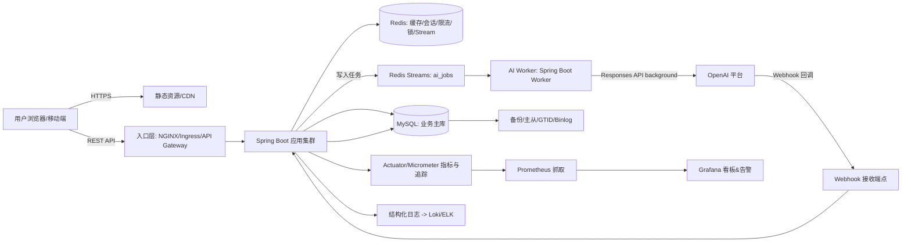
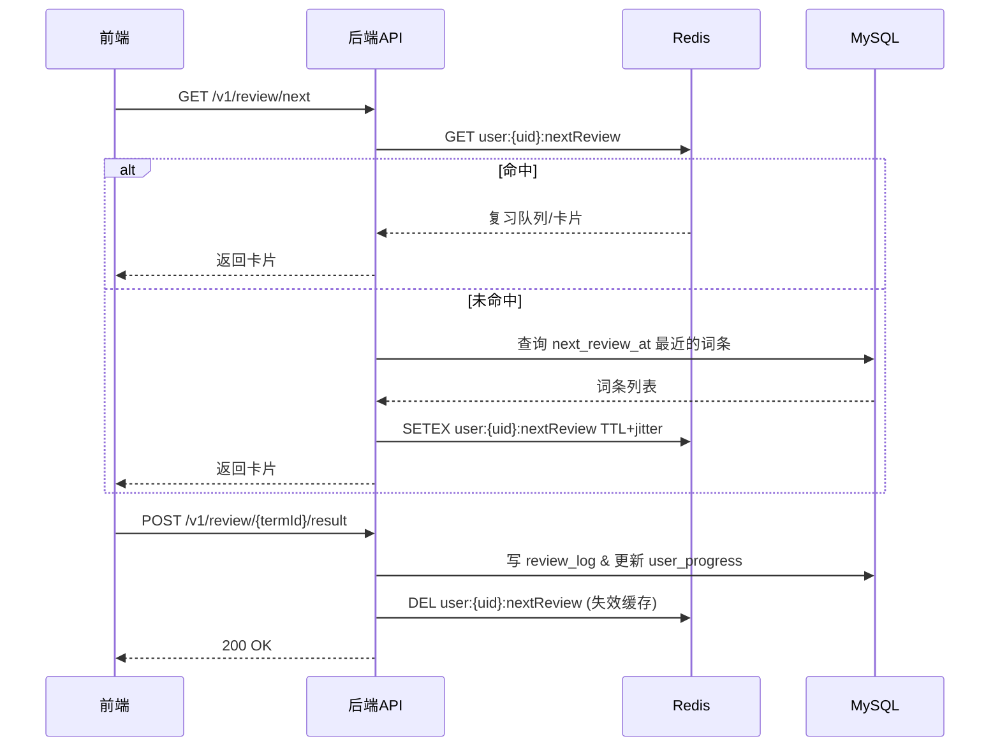
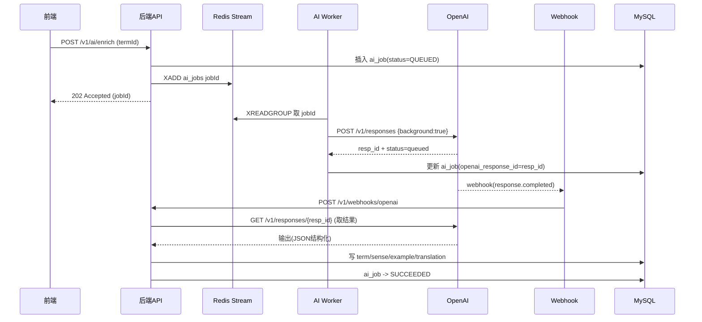
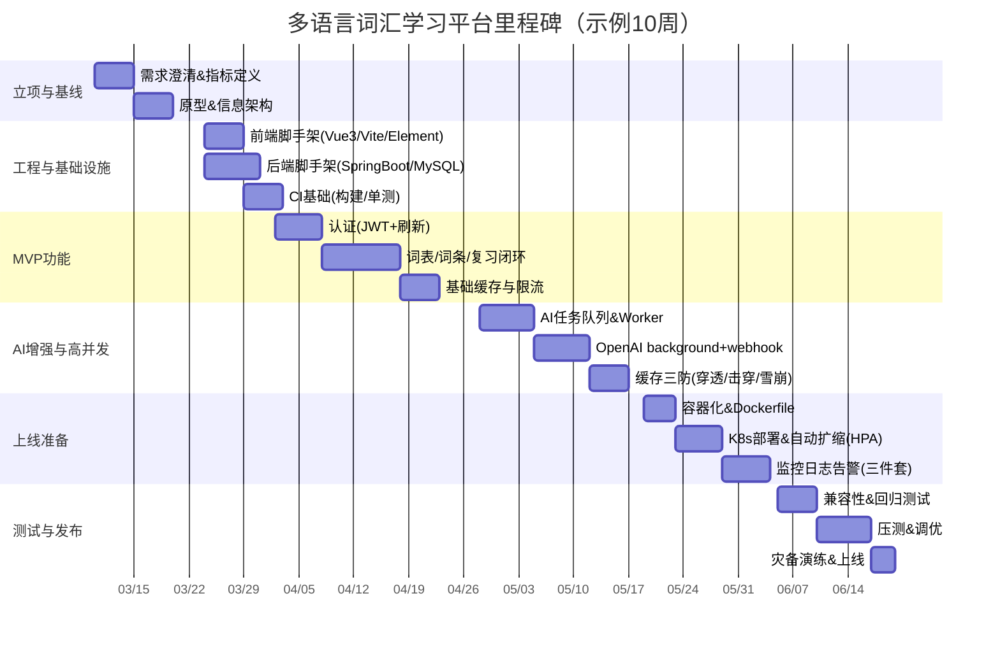

# 多语言词汇学习平台（高并发全栈系统）完整开发流程与落地方案

## 执行摘要

本报告给出一个“团队照着做就能上线”的开发流程，用来构建 **多语言词汇学习平台**：用户能注册登录、创建词表、添加词汇、刷单词卡/做测验、用间隔重复（SRS）安排复习；系统支持高并发访问，并提供缓存防护、监控告警、安全加固、回滚与灾备。核心技术栈按你的要求：前端 **Vue 3 + Vite + Element Plus（Vue3 对应的 Element UI 升级版）**、后端 **Spring Boot**、数据库 **MySQL**、缓存 **Redis**、认证 **JWT**、并集成 **OpenAI API 的异步调用（background + webhook 或队列 worker）**。citeturn0search2turn0search5turn2search0turn2search1

你给的并发目标是“高并发（未指定 QPS）”。这会影响：是否需要读写分离、是否要引入消息队列、Redis 是否需要集群、以及应用是否拆分服务。报告中给出三个可选目标 **QPS 1000 / 5000 / 10000** 的设计差异，并明确：上线前必须把 **峰值 QPS、P95/P99 延迟目标、读写比、数据规模（词条数、日活、复习记录增长速度）** 定下来，否则“高并发”只能做成“看起来很强但不一定对你业务最省钱/最稳”。citeturn16search1turn10search7

最后，这份方案把工作拆成可执行里程碑：每一步交付什么、怎么做、怎么验收、谁来做、工时预估，并给出：数据库 DDL、REST API 示例、缓存穿透/击穿/雪崩治理、容器化与 K8s 扩展、CI/CD、兼容性与性能测试、监控日志、安全加固、回滚与灾备策略。

## 需求澄清与关键决策

### 需求边界与最小可用版本

为了能按里程碑落地，建议把功能分三层（从“能用”到“能扛”）：

**基础学习闭环（MVP 必须有）**  
用户注册/登录、语言选择、词表管理、添加词条、查看词条详情（释义/例句/发音可选）、复习/测验并记录结果、下一次复习时间（SRS）。这些是平台“每天有人用”的最小闭环。

**内容增强（提升留存）**  
例句、词形变化、同义词/反义词、对比易混词、多语言释义、语音（可先用浏览器 TTS）。浏览器端语音能力属于 Web Speech API，生产可用性要看兼容性与 HTTPS 条件。citeturn14search2

**高并发与可运营（上线后持续建设）**  
缓存体系、限流熔断、监控告警、审计日志、性能压测与容量规划、CI/CD、一键回滚、备份与灾备等。

### 并发目标选项与设计差异（必须先定）

下面给出三个“可谈判的 QPS 目标”，以及对应架构差异。你可以把它当成“报价单”：目标越高，系统复杂度越高、成本越高。

| 目标档位 | 典型形态 | 关键差异点 | 推荐策略 |
|---|---|---|---|
| QPS 1000 | 单体应用（模块化）+ MySQL 主库 + Redis 单实例/哨兵 | 主要矛盾是 DB 压力与热点Key | 缓存命中率 > 80%、合理索引、限流、防击穿三件套 |
| QPS 5000 | 应用多实例 + MySQL 主从（读写分离）+ Redis 高可用 + 独立 AI Worker | 需要把“慢任务”从主链路拿掉 | Redis Streams/消息队列 + Worker；OpenAI 调用全部异步 |
| QPS 10000 | 服务拆分（网关/鉴权/学习/AI）+ MySQL 分库分表或强读扩展 + Redis Cluster | 需要更强的横向扩展与隔离 | 网关层全局限流、热点数据分层缓存、搜索/推荐可能独立引擎 |

设计上最关键的“分水岭”是：**OpenAI 调用是否在用户请求线程里做**。答案应该是：**绝不能**。要么用 OpenAI 的 background mode + webhook，要么内部队列 + worker。citeturn2search0turn2search1turn1search1

### 技术选型对比表（关键决策点、替代方案、权衡）

| 领域 | 本方案默认 | 替代方案 | 你需要知道的权衡 |
|---|---|---|---|
| 前端 UI | Element Plus（Vue3 对应） | Ant Design Vue / Naive UI | 你写“ElementUI”，但 Element UI 主要面向 Vue2；Vue3 推荐 Element Plus。citeturn0search2turn13search3 |
| 前端状态 | Pinia | Vuex（旧） | Pinia 更贴合 Vue3 组合式写法，结构更轻。citeturn13search0turn13search4 |
| API 文档 | OpenAPI 3 + springdoc-openapi | Swagger 手写 / Apifox 导出 | OpenAPI 是语言无关标准；springdoc 可自动生成并带 UI。citeturn16search0turn15search3turn15search7 |
| 认证 | JWT Access + Refresh（旋转） | Session/Cookie | JWT 是无状态，易扩展；但要做好过期、撤销与签名算法安全。citeturn3search3turn11search2 |
| 缓存 | Redis（Cache-Aside） | Memcached | Redis 支持更多结构、锁、Stream；Cache-Aside 是常用模式。citeturn4search7turn18search2 |
| 防穿透 | 空值缓存 +（可选）Bloom Filter | 只做空值缓存 | Bloom Filter 空间省、速度快，但有误判；Redis 有 Bloom Filter 文档/模块可用。citeturn5search10turn17search3 |
| 防击穿 | 互斥锁/逻辑过期 | 只靠短 TTL | 互斥锁可用 `SET NX EX`；Redis 同时提示单实例锁模式有局限，可参考 Redlock。citeturn5search8turn18search0 |
| 限流 | NGINX limit_req + 应用内限流 | Envoy / API 网关 | NGINX limit_req 是漏桶算法，简单有效；更复杂场景可换 Envoy。citeturn21search1turn21search2 |
| OpenAI 异步 | background + webhook（推荐） | 内部队列 worker（也可） | background 支持长任务；可轮询或 webhook 回调；webhook 建议验签。citeturn25view0turn25view1turn24search0 |
| 部署 | Docker + Kubernetes + HPA | 仅 VM/Compose | K8s HPA 可自动扩缩；Deployment 滚动更新；探针保证流量只打到健康 Pod。citeturn6search0turn23search0turn23search3turn6search2 |
| 可观测性 | Actuator+Micrometer + Prometheus + Grafana + Loki + OTel | ELK / APM 商业 | Spring Boot 对 Micrometer/Actuator 有自动配置；Prometheus 通过抓取 /metrics。citeturn4search0turn10search7turn9search2turn10search2turn4search4 |
| 安全基线 | OWASP API Top 10 + 密码安全存储 + JWT 安全建议 | “只做登录” | API 安全常见风险清单可直接对照做；密码存储与 JWT 坑很多，别靠经验。citeturn11search0turn11search1turn11search2 |

## 系统架构与数据模型

### 架构总览与组件职责

用一句话讲清楚：  
**用户请求走“快路径”（读缓存、写数据库）**；  
**AI 生成走“慢路径”（进队列/后台任务，完成后回写数据库）**；  
**缓存负责扛读流量，数据库负责最终正确性**。

下面是推荐的“可从小做大”的架构（模块化单体起步，后期可拆）：



关键点依据：  
- Prometheus 通过抓取 HTTP metrics 端点采集指标（pull 模式）。citeturn10search7turn4search1  
- Spring Boot Actuator 对 Micrometer 有依赖管理与自动配置，且包含指标与可观测性三大支柱（日志/指标/追踪）的落地点。citeturn4search0turn4search4turn9search3  
- Kubernetes Deployment/HPA 用于应用横向扩缩与滚动更新。citeturn6search0turn23search0  
- OpenAI background mode + webhooks 用于长任务异步完成与回调。citeturn25view0turn25view1  

### 核心业务流程示意图

**学习与复习（快路径）**：尽量只走“APP+Redis+MySQL”，不碰 OpenAI。



**AI 生成（慢路径）**：用户发起后立即返回“任务已创建”，真正生成在后台跑。



OpenAI webhooks 建议做签名校验；官方文档明确说明“可不验但不推荐”，并提供验签思路。citeturn24search0turn25view1

### MySQL 数据模型与 DDL（建议直接用 Flyway 管理）

设计目标：  
- **读多写少** 的“词条内容”尽量结构化存储，方便缓存。  
- **写多读多** 的“学习记录/复习日志”单独表，索引按 user_id + 时间维度。  
- 所有文本统一 `utf8mb4`，避免多语言字符问题。  

下面 DDL 是“能跑起来 + 能扩展”的版本（可按你团队习惯拆更多表）：

```sql
-- 建议：MySQL 8.x，字符集 utf8mb4
CREATE TABLE users (
  id              BIGINT PRIMARY KEY AUTO_INCREMENT,
  email           VARCHAR(190) NOT NULL UNIQUE,
  password_hash   VARCHAR(255) NOT NULL,
  display_name    VARCHAR(64)  NOT NULL,
  status          TINYINT      NOT NULL DEFAULT 1, -- 1=active,0=disabled
  created_at      DATETIME(3)  NOT NULL DEFAULT CURRENT_TIMESTAMP(3),
  updated_at      DATETIME(3)  NOT NULL DEFAULT CURRENT_TIMESTAMP(3) ON UPDATE CURRENT_TIMESTAMP(3)
) ENGINE=InnoDB;

CREATE TABLE languages (
  id          INT PRIMARY KEY AUTO_INCREMENT,
  iso_code    VARCHAR(20) NOT NULL UNIQUE,   -- e.g. en, zh-Hans, ja
  name        VARCHAR(64) NOT NULL,
  direction   ENUM('ltr','rtl') NOT NULL DEFAULT 'ltr',
  created_at  DATETIME(3) NOT NULL DEFAULT CURRENT_TIMESTAMP(3)
) ENGINE=InnoDB;

-- term: 单词/词组在某个语言下的“表面形态”
CREATE TABLE terms (
  id              BIGINT PRIMARY KEY AUTO_INCREMENT,
  language_id     INT NOT NULL,
  text            VARCHAR(255) NOT NULL,
  normalized_text VARCHAR(255) NOT NULL,
  ipa             VARCHAR(128) NULL,
  audio_url       VARCHAR(512) NULL,
  created_at      DATETIME(3) NOT NULL DEFAULT CURRENT_TIMESTAMP(3),
  updated_at      DATETIME(3) NOT NULL DEFAULT CURRENT_TIMESTAMP(3) ON UPDATE CURRENT_TIMESTAMP(3),
  UNIQUE KEY uk_lang_norm (language_id, normalized_text),
  KEY idx_lang_text (language_id, text),
  CONSTRAINT fk_terms_lang FOREIGN KEY (language_id) REFERENCES languages(id)
) ENGINE=InnoDB;

-- sense: 一个 term 可有多个词性/释义
CREATE TABLE senses (
  id           BIGINT PRIMARY KEY AUTO_INCREMENT,
  term_id      BIGINT NOT NULL,
  part_of_speech VARCHAR(32) NULL, -- noun/verb/adj...
  definition   TEXT NULL,          -- 可存“源语言释义”或“中介语言释义”
  created_at   DATETIME(3) NOT NULL DEFAULT CURRENT_TIMESTAMP(3),
  KEY idx_term (term_id),
  CONSTRAINT fk_senses_term FOREIGN KEY (term_id) REFERENCES terms(id)
) ENGINE=InnoDB;

-- translation: 某个 sense 到目标语言的一条翻译
CREATE TABLE translations (
  id                 BIGINT PRIMARY KEY AUTO_INCREMENT,
  sense_id           BIGINT NOT NULL,
  target_language_id INT NOT NULL,
  translated_text    VARCHAR(512) NOT NULL,
  source_type        ENUM('manual','openai','import') NOT NULL DEFAULT 'openai',
  created_at         DATETIME(3) NOT NULL DEFAULT CURRENT_TIMESTAMP(3),
  KEY idx_sense_target (sense_id, target_language_id),
  CONSTRAINT fk_trans_sense FOREIGN KEY (sense_id) REFERENCES senses(id),
  CONSTRAINT fk_trans_lang FOREIGN KEY (target_language_id) REFERENCES languages(id)
) ENGINE=InnoDB;

-- example_sentences: 例句（可多语言）
CREATE TABLE example_sentences (
  id              BIGINT PRIMARY KEY AUTO_INCREMENT,
  sense_id         BIGINT NOT NULL,
  language_id      INT NOT NULL,
  sentence_text    TEXT NOT NULL,
  sentence_trans   TEXT NULL,
  source_type      ENUM('manual','openai','import') NOT NULL DEFAULT 'openai',
  created_at       DATETIME(3) NOT NULL DEFAULT CURRENT_TIMESTAMP(3),
  KEY idx_sense_lang (sense_id, language_id),
  CONSTRAINT fk_es_sense FOREIGN KEY (sense_id) REFERENCES senses(id),
  CONSTRAINT fk_es_lang FOREIGN KEY (language_id) REFERENCES languages(id)
) ENGINE=InnoDB;

-- 用户词表
CREATE TABLE vocab_lists (
  id               BIGINT PRIMARY KEY AUTO_INCREMENT,
  user_id          BIGINT NOT NULL,
  name             VARCHAR(64) NOT NULL,
  source_language_id INT NOT NULL,
  target_language_id INT NOT NULL,
  is_public        TINYINT NOT NULL DEFAULT 0,
  created_at       DATETIME(3) NOT NULL DEFAULT CURRENT_TIMESTAMP(3),
  updated_at       DATETIME(3) NOT NULL DEFAULT CURRENT_TIMESTAMP(3) ON UPDATE CURRENT_TIMESTAMP(3),
  KEY idx_user (user_id),
  CONSTRAINT fk_vl_user FOREIGN KEY (user_id) REFERENCES users(id),
  CONSTRAINT fk_vl_src_lang FOREIGN KEY (source_language_id) REFERENCES languages(id),
  CONSTRAINT fk_vl_tgt_lang FOREIGN KEY (target_language_id) REFERENCES languages(id)
) ENGINE=InnoDB;

-- 词表条目（一个词表里有哪些 term/sense）
CREATE TABLE vocab_items (
  id          BIGINT PRIMARY KEY AUTO_INCREMENT,
  list_id     BIGINT NOT NULL,
  term_id     BIGINT NOT NULL,
  sense_id    BIGINT NULL, -- 可选：指定某个释义
  created_at  DATETIME(3) NOT NULL DEFAULT CURRENT_TIMESTAMP(3),
  UNIQUE KEY uk_list_term (list_id, term_id),
  KEY idx_list (list_id),
  CONSTRAINT fk_vi_list FOREIGN KEY (list_id) REFERENCES vocab_lists(id),
  CONSTRAINT fk_vi_term FOREIGN KEY (term_id) REFERENCES terms(id),
  CONSTRAINT fk_vi_sense FOREIGN KEY (sense_id) REFERENCES senses(id)
) ENGINE=InnoDB;

-- 学习进度（SRS 核心表）
CREATE TABLE user_progress (
  id              BIGINT PRIMARY KEY AUTO_INCREMENT,
  user_id         BIGINT NOT NULL,
  term_id         BIGINT NOT NULL,
  ease_factor     DECIMAL(4,2) NOT NULL DEFAULT 2.50,
  interval_days   INT NOT NULL DEFAULT 0,
  repetition      INT NOT NULL DEFAULT 0,
  next_review_at  DATETIME(3) NOT NULL,
  last_review_at  DATETIME(3) NULL,
  updated_at      DATETIME(3) NOT NULL DEFAULT CURRENT_TIMESTAMP(3) ON UPDATE CURRENT_TIMESTAMP(3),
  UNIQUE KEY uk_user_term (user_id, term_id),
  KEY idx_user_next (user_id, next_review_at),
  CONSTRAINT fk_up_user FOREIGN KEY (user_id) REFERENCES users(id),
  CONSTRAINT fk_up_term FOREIGN KEY (term_id) REFERENCES terms(id)
) ENGINE=InnoDB;

-- 复习日志（增长快，后期可按月分区）
CREATE TABLE review_logs (
  id          BIGINT PRIMARY KEY AUTO_INCREMENT,
  user_id     BIGINT NOT NULL,
  term_id     BIGINT NOT NULL,
  rating      TINYINT NOT NULL, -- 0~5
  elapsed_ms  INT NULL,
  created_at  DATETIME(3) NOT NULL DEFAULT CURRENT_TIMESTAMP(3),
  KEY idx_user_time (user_id, created_at),
  KEY idx_term_time (term_id, created_at),
  CONSTRAINT fk_rl_user FOREIGN KEY (user_id) REFERENCES users(id),
  CONSTRAINT fk_rl_term FOREIGN KEY (term_id) REFERENCES terms(id)
) ENGINE=InnoDB;

-- OpenAI 异步任务表
CREATE TABLE ai_jobs (
  id                  BIGINT PRIMARY KEY AUTO_INCREMENT,
  user_id             BIGINT NOT NULL,
  job_type            VARCHAR(32) NOT NULL, -- ENRICH_TERM / GEN_EXAMPLES ...
  status              ENUM('QUEUED','RUNNING','SUCCEEDED','FAILED') NOT NULL DEFAULT 'QUEUED',
  term_id             BIGINT NULL,
  openai_response_id  VARCHAR(64) NULL,
  request_json        JSON NOT NULL,
  result_json         JSON NULL,
  error_message       VARCHAR(1024) NULL,
  retry_count         INT NOT NULL DEFAULT 0,
  created_at          DATETIME(3) NOT NULL DEFAULT CURRENT_TIMESTAMP(3),
  updated_at          DATETIME(3) NOT NULL DEFAULT CURRENT_TIMESTAMP(3) ON UPDATE CURRENT_TIMESTAMP(3),
  KEY idx_status_created (status, created_at),
  KEY idx_term (term_id),
  CONSTRAINT fk_ai_user FOREIGN KEY (user_id) REFERENCES users(id),
  CONSTRAINT fk_ai_term FOREIGN KEY (term_id) REFERENCES terms(id)
) ENGINE=InnoDB;
```

关于事务隔离与一致性：InnoDB 支持 SQL 标准四种隔离级别且默认是 **REPEATABLE READ**；这会影响你在“复习提交”这种写操作里的并发一致性处理。citeturn5search11

### Redis Key 规范与缓存分层（建议写进团队约定）

统一 Key 命名能让所有人排查问题更快（运维同学也不骂人）。示例：

- `term:{termId}` → 词条详情（含 senses/translations/examples 的聚合 JSON）
- `term:{lang}:{normalized}` → termId（便于按词面查）
- `user:{uid}:nextReview` → 下一页复习队列（短 TTL）
- `lock:term:{termId}` → 热点 key 互斥锁
- `bf:termIds` → Bloom Filter（可选）
- `stream:ai_jobs` → Redis Streams 队列

Spring 的缓存抽象本质是 **Cache-Aside**：先查缓存，没命中再算/查 DB，然后把结果放缓存，下次复用。citeturn4search7turn4search3

## 逐步执行的开发流程与里程碑

### 甘特式时间线（Mermaid）

假设团队配置：1 前端、2 后端、1 测试、1 DevOps（半程介入）、1 PM（半程）。以 **10 周** 为基准（可压缩/拉长），并行推进。



Kubernetes 的 HPA 会自动更新工作负载（如 Deployment）来扩缩容以匹配需求，这就是我们把“高并发应对”放在 K8s 层的原因之一。citeturn6search0

### 里程碑拆解（步骤、交付物、验收、工时与角色）

以下给出每个里程碑“照着做”的执行清单。工时单位为 **人小时**（PH），并标注主要角色。

#### 里程碑目标：需求与架构基线冻结

**执行步骤**  
1) 明确并写入《非功能指标》：QPS（1000/5000/10000 选一档）、P95 延迟目标、可用性目标、数据规模预估（词条数、DAU、复习日志增长）。  
2) 输出《接口清单》：按资源划分（auth/users/lists/terms/review/ai）。用 OpenAPI 3 文档做约束，后端可用 springdoc 自动生成对齐。citeturn16search0turn15search3  
3) 输出《数据字典》：表结构、字段含义、关键索引、数据生命周期。  
4) 输出《缓存策略草案》：哪些缓存、TTL、多级缓存、失效规则。

**里程碑交付物**  
- OpenAPI 草案（至少列出路径、请求/响应模型、状态码）  
- ER 图/DDL 草案  
- 并发目标定档

**验收标准**  
- 团队内任何人能回答：某个接口的输入输出是什么、失败怎么返回（HTTP 语义可参考 RFC 9110）。citeturn16search1

**工时与角色（估算）**  
- PM：24h；后端：24h；前端：16h；测试：8h；DevOps：8h

#### 里程碑目标：工程脚手架与本地可运行环境

**执行步骤**  
1) 前端初始化：Vite 项目、Element Plus、Pinia、Vue Router、i18n、Axios。Vite 开发/构建机制与配置参考官方文档。citeturn0search5turn13search0turn13search1turn13search2turn14search0  
2) 后端初始化：Spring Boot 工程、健康检查、结构化日志、基础目录（controller/service/repo）。Spring Boot 默认日志实现是 Logback。citeturn9search3  
3) 本地环境：docker-compose 起 MySQL/Redis；后端连上；跑通 health check。  
4) CI：GitHub Actions 跑构建与单测（CI 定义与作用官方文档有清晰描述）。citeturn6search3turn6search15  

**验收标准**  
- `git clone` 后一条命令启动前后端与依赖；CI 自动跑构建。  

**工时估算**  
- 前端：32h；后端：40h；DevOps：24h；测试：8h；PM：8h

#### 里程碑目标：认证与权限（JWT）

**关键设计**  
- Access Token 短有效期（例如 15 分钟），Refresh Token 长有效期（例如 7~30 天）并支持旋转与撤销。JWT 的定义与用途可参考 RFC 7519；Java 场景 JWT 安全要点可参考 OWASP。citeturn3search3turn11search2  
- 密码必须用强哈希（例如 BCrypt），Spring Security 的 BCryptPasswordEncoder 支持可调强度（cost），强度越大计算成本指数上升。citeturn20search0turn11search1  

**执行步骤**  
1) 实现注册/登录/刷新/登出（撤销刷新令牌）。  
2) 实现 Spring Security FilterChain：鉴权在授权前执行是官方强调的顺序要求。citeturn20search1  
3) 增加接口审计日志：登录失败、刷新失败、异常 IP 等。

**验收标准**  
- 无 token 访问受保护接口返回 401；过期 token 能刷新；撤销后 refresh 失效。  

**工时估算**  
- 后端：56h；前端：24h；测试：24h；PM：8h

#### 里程碑目标：词表/词条/复习闭环（MVP 真正可用）

**执行步骤**  
1) 词表 CRUD；词条添加（手动/导入）；词条详情页。  
2) 复习流程：拉取“下一条/下一组”，提交结果，更新 user_progress.next_review_at，并写 review_logs。  
3) 关键 SQL 加索引：`user_progress(user_id, next_review_at)` 用来快速取“该用户最该复习的词”。  
4) 前端实现：路由守卫、接口错误提示、loading、防重复提交。Vue Router 的导航守卫机制官方文档可查。citeturn13search9  

**验收标准**  
- 一个新用户从 0 到完成第一次复习，流程不断；复习后能在未来时间再出现该词。  

**工时估算**  
- 前端：80h；后端：120h；测试：60h；PM：16h

#### 里程碑目标：缓存、限流、并发防护（让系统“扛得住”）

**执行步骤**  
1) Cache-Aside：term 详情、语言列表等读多写少资源缓存到 Redis；写操作后失效缓存。Spring Boot 的缓存与 RedisCacheManager 自动配置有官方说明。citeturn4search3turn4search15  
2) NGINX 限流：对匿名接口、登录接口做 limit_req；其漏桶限流机制在官方文档中说明。citeturn21search1  
3) 应用内限流/熔断：对外部依赖（OpenAI）用指数退避重试与熔断（Resilience4j 可配置 RateLimiter/Retry/CircuitBreaker）。citeturn15search2turn15search6turn1search1  

**验收标准**  
- 压测下数据库连接数稳定；热点接口 P95 延迟不爆炸；登录接口无暴力撞库风险放大。  

**工时估算**  
- 后端：72h；DevOps：40h；测试：40h；前端：16h；PM：8h

#### 里程碑目标：OpenAI 异步能力接入（AI 增强但不拖慢用户）

**关键依据**  
- background mode：通过 `background=true` 启动长任务，随后轮询 Responses 状态；文档明确 background 会保留响应数据约 10 分钟用于轮询，并提醒与 ZDR 兼容性问题。citeturn25view0turn2search4  
- webhooks：OpenAI webhooks 遵循 Standard Webhooks，并建议对 webhook 请求验签。citeturn25view1turn24search1turn24search0  
- Java SDK：官方 Java SDK 支持异步执行（`async()`）与 webhook `unwrap()`/`verifySignature()`。citeturn25view3turn27view0turn26search0  

**执行步骤**  
1) 建 ai_jobs 表（已给 DDL），并实现任务生命周期：QUEUED → RUNNING → SUCCEEDED/FAILED。  
2) 用 Redis Streams 做任务派发（consumer group），Worker 消费任务并调用 OpenAI。Redis Streams 的 consumer group 能提供确认、pending 管理等队列能力。citeturn18search2turn18search9  
3) OpenAI 调用使用 background=true；落库 response_id；等待 webhook；回调后拉取最终结果写回 term/sense/examples。citeturn25view0turn25view1  

**验收标准**  
- 用户点击“AI 补全”后 1 秒内返回 jobId；job 最终完成，前端可轮询看到结果；失败可重试且不重复写脏数据。  

**工时估算**  
- 后端：96h；DevOps：24h；测试：40h；前端：40h；PM：8h

## 关键实现细节

### 前端（Vue3 + Vite + Element Plus + i18n + Axios）示例

**要点**  
- Element Plus 支持全局 locale 配置。citeturn13search3  
- 用 vue-i18n 的 Composition API 需要 `legacy:false`。citeturn14search0  
- Axios 超时 + 取消请求可避免网络卡死。citeturn13search2  

**main.ts（示例）**

```ts
import { createApp } from 'vue'
import { createPinia } from 'pinia'
import ElementPlus from 'element-plus'
import zhCn from 'element-plus/es/locale/lang/zh-cn'
import App from './App.vue'
import router from './router'
import { i18n } from './i18n'

const app = createApp(App)

app.use(createPinia())
app.use(router)
app.use(i18n)

app.use(ElementPlus, { locale: zhCn })

app.mount('#app')
```

**Axios 实例：自动带 token + 401 自动刷新（示意）**

```ts
import axios, { AxiosError } from 'axios'
import { useAuthStore } from '@/stores/auth'

export const http = axios.create({
  baseURL: import.meta.env.VITE_API_BASE,
  timeout: 8000,
})

http.interceptors.request.use((config) => {
  const auth = useAuthStore()
  if (auth.accessToken) config.headers.Authorization = `Bearer ${auth.accessToken}`
  return config
})

let refreshing: Promise<void> | null = null

http.interceptors.response.use(
  (res) => res,
  async (err: AxiosError) => {
    const auth = useAuthStore()
    if (err.response?.status === 401 && auth.refreshToken) {
      if (!refreshing) {
        refreshing = auth.refreshAccessToken().finally(() => (refreshing = null))
      }
      await refreshing
      return http(err.config!)
    }
    return Promise.reject(err)
  }
)
```

**路由守卫：未登录跳登录页（示意）**

```ts
router.beforeEach((to) => {
  const auth = useAuthStore()
  if (to.meta.requiresAuth && !auth.accessToken) {
    return { name: 'Login', query: { redirect: to.fullPath } }
  }
})
```

Vue Router 的导航守卫属于官方支持的常规做法。citeturn13search9

### 后端（Spring Boot + Spring Security + JWT）示例

**密码哈希：BCrypt**  
Spring Security 提供 BCryptPasswordEncoder，强度越大会指数增加计算成本（更安全但更费 CPU）。citeturn20search0

```java
@Bean
public PasswordEncoder passwordEncoder() {
    return new BCryptPasswordEncoder(12);
}
```

**SecurityFilterChain（思路示例）**  
- Stateless API 通常禁用 session；  
- JWT 校验放在授权之前（Spring Security 的过滤器链顺序原则）。citeturn20search1

```java
@Bean
public SecurityFilterChain filterChain(HttpSecurity http) throws Exception {
    return http
      .csrf(csrf -> csrf.disable())
      .sessionManagement(sm -> sm.sessionCreationPolicy(SessionCreationPolicy.STATELESS))
      .authorizeHttpRequests(reg -> reg
          .requestMatchers("/v1/auth/**", "/actuator/health").permitAll()
          .anyRequest().authenticated()
      )
      .addFilterBefore(jwtAuthFilter, UsernamePasswordAuthenticationFilter.class)
      .build();
}
```

### REST API 设计（示例）

状态码语义以 HTTP 规范为准：2xx 成功、4xx 客户端错误、5xx 服务端错误。citeturn16search1

**登录**  
- `POST /v1/auth/login`

请求：
```json
{ "email": "a@b.com", "password": "xxx" }
```

响应（200）：
```json
{
  "code": 0,
  "message": "OK",
  "data": {
    "accessToken": "xxx",
    "refreshToken": "yyy",
    "expiresIn": 900
  },
  "traceId": "..."
}
```

**创建 AI 任务（异步）**  
- `POST /v1/ai/enrich`

请求：
```json
{ "termId": 123, "targetLang": "zh-Hans" }
```

响应（202 Accepted）：
```json
{
  "code": 0,
  "message": "JOB_QUEUED",
  "data": { "jobId": 999 }
}
```

### 缓存策略与三类“缓存灾难”治理（穿透/击穿/雪崩）

先把三个词说人话：

- **穿透**：有人一直查“根本不存在”的数据，缓存也没有，数据库被打穿。  
- **击穿**：一个“超级热门”数据刚好过期，瞬间所有人一起去查数据库。  
- **雪崩**：一大批缓存同一时间过期/Redis 故障，数据库被集体冲击。

#### 缓存穿透：空值缓存 + Bloom Filter（可选）

- 空值缓存：查不到就缓存一个“空”，给一个短 TTL，避免同一个不存在的 key 被反复打到 DB。  
- Bloom Filter：用很小内存快速判断“某 id 大概率不存在”，直接拦截。Redis 提供 Bloom filter 文档与数据结构说明。citeturn5search10turn17search3

#### 缓存击穿：互斥锁/逻辑过期

Redis `SET key value NX EX` 可用于简单锁；官方命令文档明确提到这是实现锁的一种方式，同时提示该简单模式不如 Redlock 保证好。citeturn5search8turn18search0

```java
public String getTermWithMutex(long termId) {
  String key = "term:" + termId;
  String cached = redis.get(key);
  if (cached != null) return cached;

  String lockKey = "lock:term:" + termId;
  boolean locked = redis.setIfAbsent(lockKey, "1", Duration.ofSeconds(5));
  if (!locked) {
    // 没抢到锁：短暂睡眠后重试（不要无限自旋）
    sleep(50);
    return redis.get(key);
  }
  try {
    // double check
    cached = redis.get(key);
    if (cached != null) return cached;

    String value = dbQueryTermJson(termId);
    if (value == null) {
      redis.set(key, "__NULL__", Duration.ofSeconds(30));
      return null;
    }
    // TTL + jitter
    redis.set(key, value, Duration.ofMinutes(30 + random(0, 5)));
    return value;
  } finally {
    redis.del(lockKey);
  }
}
```

#### 缓存雪崩：TTL 抖动 + 分批预热 + 降级

“TTL 抖动”属于权威推荐做法：AWS 关于 Redis 缓存策略的白皮书明确建议给 TTL 加 jitter，避免大量 key 同时过期造成后端压力峰值。citeturn17search5  
配合手段：  
- 热点 key 预热（上线/发布后先把最常用词条写入缓存）  
- Redis 故障时降级：返回简化页面/只返回词面不返回例句/提示稍后再试

### OpenAI API 异步调用（Java SDK + background + webhook）示例

**为什么必须异步**  
- OpenAI 有 rate limit，需要重试与退避；并且失败请求也会计入限额，盲目重试会更糟。citeturn1search1  
- background mode 支持长任务并避免超时；官方给出 `background=true` 的用法与轮询方式。citeturn25view0  
- webhooks 可在任务完成后回调，并建议验签。citeturn25view1turn24search0  

**发送后台任务（Worker）**

```java
import com.openai.client.OpenAIClient;
import com.openai.client.okhttp.OpenAIOkHttpClient;
import com.openai.models.responses.Response;
import com.openai.models.responses.ResponseCreateParams;

OpenAIClient client = OpenAIOkHttpClient.fromEnv(); // 读取 OPENAI_API_KEY 等

public String createEnrichJob(String prompt) {
    ResponseCreateParams params = ResponseCreateParams.builder()
        .model("gpt-5.4")
        .input(prompt)
        .background(true)
        .build();

    Response resp = client.responses().create(params);
    // resp.id() 保存到 ai_jobs.openai_response_id
    return resp.id();
}
```

**Webhook 接收与验签（后端 API）**  
官方 Java SDK 支持 `client.webhooks().unwrap()`（解析并验签）与 `verifySignature()`（只验签）。citeturn27view0turn26search0

```java
import com.openai.core.http.Headers;
import com.openai.models.webhooks.UnwrapWebhookEvent;

@PostMapping("/v1/webhooks/openai")
public ResponseEntity<Void> onOpenAiWebhook(
        @RequestBody String rawBody,
        @RequestHeader Map<String, String> headersMap) {

    Headers headers = Headers.builder().putAll(headersMap).build();

    UnwrapWebhookEvent event = openAiClient.webhooks().unwrap(rawBody, headers, Optional.empty());

    if (event.isResponseCompletedWebhookEvent()) {
        String responseId = event.asResponseCompletedWebhookEvent().data().id();
        // 这里再调用 responses.retrieve(responseId) 获取输出并落库
    }
    return ResponseEntity.ok().build();
}
```

## 部署扩展与运维体系

### 容器化（Docker）与多阶段构建

多阶段构建可以把“构建依赖”留在前一阶段，最终镜像更小、更安全，这是 Docker 官方文档推荐方式。citeturn6search6

（示意：前端 build → NGINX 静态站点；后端 build → 运行镜像）

### Kubernetes 部署与扩缩容

- **Deployment**：声明式更新与滚动发布（maxSurge/maxUnavailable）。citeturn23search0turn23search8  
- **HPA**：根据负载自动扩缩容。citeturn6search0  
- **探针**：readiness/liveness/startup，保证流量只到“准备好”的 Pod。citeturn23search3  
- **Ingress**：对外 HTTP 入口；但官方文档也说明 Kubernetes 更推荐 Gateway，而 Ingress API 已冻结。实际落地可先用 Ingress（生态成熟），同时为 Gateway 预留迁移空间。citeturn21search3  

配置与密钥：  
- ConfigMap 用于非机密配置；Secret 用于密码/令牌/密钥，官方概念文档明确其用途差异。citeturn22search3turn22search2  

### CI/CD（以 GitHub Actions 为例）

GitHub Actions 官方文档明确它可用于自动执行构建、测试与部署流水线。citeturn6search15  
建议流水线最少包含：  
- 前端：lint + unit test + build  
- 后端：unit + integration（Testcontainers）+ build  
- 镜像：build + scan（Trivy）+ push  
- 部署：Helm upgrade/rollback（Helm quickstart 给出 install/upgrade 基本模式）citeturn6search13turn22search4  

### 监控、日志、追踪（“三件套”）

- Spring Boot Observability 将可观测性定义为从外部观察系统内部状态，三大支柱是 logging/metrics/traces，并以 Micrometer Observation 为核心。citeturn4search4  
- Prometheus 从目标的 metrics HTTP endpoint 抓取指标。citeturn10search7  
- Grafana 提供 dashboard 与告警体系的文档支持。citeturn9search6turn9search2  
- Loki 是 Grafana 体系里常见的日志栈组件。citeturn10search2  
- OpenTelemetry 是厂商中立的可观测框架，覆盖 trace/metrics/logs 并基于上下文传播。citeturn9search4turn9search0  
- Spring Boot 默认使用 Logback（starter 默认），并且官方博客介绍了结构化日志（JSON）理念与价值。citeturn9search3turn9search7  

**建议落地的指标（最少集）**  
- 流量：QPS、错误率（4xx/5xx）、P95/P99 延迟  
- 缓存：命中率、热点 key、锁等待时间  
- DB：连接池占用、慢查询数量、事务冲突  
- AI：任务队列长度、成功率、平均耗时、OpenAI 429 次数（限流）citeturn1search4turn1search1  

### 安全加固要点（可直接做成检查表）

以 OWASP API Security Top 10（2023）为对照，最低要做到：鉴权、对象级授权、输入校验、接口资产清单与版本管理等。citeturn11search0turn11search4  
密码存储参考 OWASP Password Storage Cheat Sheet（不要可逆加密存密码）。citeturn11search1turn11search5  
JWT 在 Java 中的常见坑（算法混淆、弱密钥、过期与撤销、敏感信息放 token）可参考 OWASP JWT for Java Cheat Sheet。citeturn11search2turn11search6  
网关侧限流：NGINX `limit_req` 可按 IP/用户做速率限制（漏桶）。citeturn21search1  
镜像安全：Trivy 可扫描镜像中的漏洞/配置问题/密钥泄露等。citeturn22search4turn22search0  

## 测试、验收、回滚与灾备策略

### 兼容性与自动化测试方案

**前端**  
- E2E：Playwright 支持 Chromium/WebKit/Firefox，适合跨浏览器回归。citeturn8search2turn8search6  
- 或者 Cypress（同样是主流 E2E）。citeturn8search3turn8search7  

**后端**  
- 单元测试：JUnit（略）  
- 集成测试：Testcontainers 提供“用完就丢”的真实数据库/依赖组件容器，适合测 MySQL/Redis 交互。citeturn7search1  

**接口契约**  
- 用 OpenAPI 作为契约源头（“先定义后实现”）；OpenAPI 的标准定义与用途在规范中有明确说明。citeturn16search0  

### 性能测试与容量验证（必须在上线前做）

工具选择：  
- k6：官方文档定位为负载与性能测试工具，适合做 spike/stress/soak。citeturn7search3  
- JMeter：Apache 官方用户手册完善，适合大量 HTTP/JDBC 压测场景。citeturn8search1  
- Gatling：官方文档完善，适合脚本化模拟大量虚拟用户。citeturn8search0  

**压测方法（建议固定成模板）**  
1) 先测单接口（词条详情/复习提交/登录）  
2) 再测混合场景（70% 读词条、20% 拉复习、10% 写复习记录）  
3) 逐档提升到目标 QPS（1000/5000/10000）  
4) 观察：P95、错误率、DB 连接池、Redis 命中率、GC、OpenAI 429  

### 回滚策略（应用/数据库）

**应用回滚**  
- K8s：Deployment 天生支持回滚到上一 ReplicaSet（滚动发布机制）。citeturn23search0  
- Helm：可用历史版本回滚（Helm quickstart 提供 install/upgrade 的基本模式；实际回滚是常规能力）。citeturn6search13turn6search17  

**数据库迁移策略**  
- Flyway 版本化迁移最好“只向前”，已应用的版本不要改，新增脚本修正；Redgate 文档强调版本化迁移按顺序且只应用一次，schema history 记录校验和。citeturn7search8  
- 真实生产里更推荐“前滚修复”而不是指望随意 rollback（否则会把发布变成赌博）。  

### 灾备与数据恢复（MySQL + Redis）

**MySQL 备份**  
- mysqldump 做逻辑备份，官方文档说明它会导出 SQL 语句用于重建数据。citeturn12search0  
- 二进制日志可用于时间点恢复（Point-in-Time Recovery），官方文档有专门章节说明。citeturn12search1turn12search9  
- 高可用：主从复制 + GTID 能简化故障切换与跟踪事务，官方文档明确其作用。citeturn12search2turn12search10  

**Redis 灾备**  
- Redis 的定位是缓存/队列等“加速层”，不要把它当唯一数据源；Redis 故障时要有降级与回源策略（同时避免把 DB 打爆）。TTL 抖动与负缓存是权威建议之一。citeturn17search5turn17search17  

**RPO/RTO 建议写进目标**  
- RPO（最多丢多久数据）：例如 1 分钟（binlog）  
- RTO（多久恢复服务）：例如 30 分钟（切主+回滚+回放）  
并定期做恢复演练（不是写文档就算完成）。

---

以上流程的核心思想是：**先把“可用的学习闭环”做出来，再把“高并发需要的工程化能力”逐步补齐**；同时把 OpenAI 这种外部慢依赖彻底从主链路剥离，用 background/webhook 或队列 worker 异步化，避免把平台稳定性押在第三方响应时间上。citeturn25view0turn25view1turn1search1